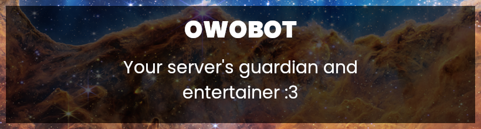

  

  &nbsp;
  &nbsp;
  &nbsp;
  

owobot is a versatile Discord bot with a wide range of capabilities, from moderation to utilities to entertainment. Using state-of-the-art Discord features, owobot takes your server experience to the next level. It's the ultimate companion for your Discord server!

## Table of contents

- [Installation Options](#installation-options)
  - [Linux packages](#linux-packages)
  - [OCI/Docker images](#ocidocker-images)
- [Features](#features)
  - [Vetting](#vetting)
  - [Tickets](#tickets)
  - [Eventlog](#eventlog)
  - [Reactions](#reactions)
  - [Reaction Roles](#reaction-roles)
  - [Polls](#polls)
  - [Starboard](#starboard)
  - [Rate Limiting](#rate-limiting)

## Installation Options

### Linux packages

The [latest release](https://gitea.elara.ws/owobot/owobot/releases/latest) of owobot has packages for many distros and processors. They include a systemd service to make the bot easier to use. Just install the package, edit the bot's configuration to suit your needs, and run it using `sudo systemctl enable --now owobot`. Systemd will monitor it and make sure it's always running.

### OCI/Docker images

For more advanced users, owobot provides OCI/Docker images, which can be used with Docker, Podman, LXC, and many other programs. Make sure to set `OWOBOT_DB_PATH` to wherever you've mounted the database. The image is rootless by default, so make sure that uid `65532` can access the database, or manually set the image to run as root using `-u root`.

## Features

### Vetting

To catch trolls and other troublemakers before they get access to your server, owobot can be configured to require new users to go through a vetting process before they can get access to the server.

To create a vetting message, just choose any message, click `More > Apps > Make Vetting Message`, and that's it! owobot will delete the message and post a new one with a message button which can be used by users to request vetting.

When users click the request vetting button, owobot will send a vetting request in the vetting request channel.

If a moderator accepts the request, a new ticket will be created in which mods can talk to the user. When they're finished, they can either kick the user which will automatically close the ticket, or they can approve the user using the `/approve` command.

**Commands:**

- `/vetting role` can be used by anyone with the `Manage Server` permission to set the server's vetting role. owobot will assign this role to all new users.
- `/vetting req_channel` can be used by anyone with the `Manage Server` permission to set the server's vetting request channel. This is where owobot will post vetting requests.
- `/approve` can be used by anyone with the `Kick Members` permission to approve users that are in vetting.

### Tickets

owobot can create tickets, which are private channels that allow users to talk directly to your server's moderators. When a ticket is closed, owobot compiles a log containing all the messages in the ticket and sends it to the event log ticket channel.

A user can only have one open ticket at a time.

**Commands:**

- `/ticket` can be used by any user to create a ticket for themselves
- `/mod_ticket` can be used by anyone with the `Manage Channels` permission to create a ticket for another user
- `/close_ticket` can be used by anyone with the `Manage Channels` permission to close a user's ticket
- `/ticket_category` can be used by anyone with the `Manage Server` permission to set the category in which ticket channels are created.

### Eventlog

The eventlog listens for important events such as kicks, bans, role changes, etc. and sends them to a configurable discord channel so you can always access them.

**Commands:**

- `/eventlog channel` can be used by anyone with the `Manage Server` permission to set the channel for the event log
- `/eventlog ticket_channel` can be used by anyone with the `Manage Server` permission to set the channel in which ticket conversations logs will be sent

### Reactions

owobot has a very powerful reactions system which can find content inside of messages and then react with an emoji or reply with text.

A reaction consists of a match type, match, reaction type, reaction, and an optional random chance.

The match type can either be `contains` or `regex`. The `contains` matcher just checks if a message contains some text, while the `regex` matcher checks if a message matches a specific pattern. If you're using the `regex` matcher with the `text` reaction type, you can include submatches in your reply by putting the submatch index in curly braces (for example: `{1}` or `{5}`), which lets you put parts of the original message in your reply.

The optional random chance allows you to add reactions that only occur a certain percentage of the time. Setting it to `10`, for example, means the reaction will only happen in 10% of detected messages.

**Commands:**

- `/reactions add` can be used by anyone with the `Manage Expressions` permission to add new reactions
- `/reactions list` can be used by anyone with the `Manage Expressions` permission to get a list of all existing reactions
- `/reactions delete` can be used by anyone with the `Manage Expressions` permission to delete an existing reaction

> [!NOTE]
> The `/reactions delete` command has an extra check to make sure the user has `Manage Expressions`, so you can safely add a role override on the `/reactions` command without allowing anyone without that permission to delete reactions.

### Reaction Roles

Reaction roles allow users to easily assign roles to themselves using message buttons. Reaction roles are organized in categories, which can have a name and a description. Having multiple categories with the same name is allowed, as long as they're in different channels.

**Commands:**

- `/reaction_roles new_category` can be used by anyone with the `Manage Server` permission to create a new reaction role category in the current channel
- `/reaction_roles remove_category` can be used by anyone with the `Manage Server` permission to remove an existing reaction role category from the current channel
- `/reaction_roles add` can be used by anyone with the `Manage Server` permission to add a reaction role to a category
- `/reaction_roles remove` can be used by anyone with the `Manage Server` permission to remove an existing reaction role from a category

> [!TIP]
> There's a `/neopronoun` command that any user can use to assign themselves a pronoun role. It will never assign a role that provides any permissions, so it's safe to allow for everyone.

### Polls

owobot can create polls for your members to vote in. Polls use message components and privacy tokens to ensure that votes are always private and even the person running the bot can't find out who voted for what.

You can create a poll with the `/poll` command. owobot will create a message with the title and two buttons: `Add Option` and `Finish`.

Clicking the `Add Option` button opens a pop up where you can type the text for your new option. Once you've submitted that, owobot edits the message and asks you to react with the emoji you'd like to use for that option.

Once you react, the option is added. You can keep adding options until you click the Finish button, which finalizes the poll, creates a thread, and opens it up to votes.

If a user votes multiple times, only the latest vote will be counted.

**Commands:**

- `/poll` can be used by any user to create a poll

### Starboard

The starboard is a way for your users to feature messages that they like. Users can react to messages with stars, and once a configurable threshold of stars is reached, the message will be posted to the starboard channel.

**Commands:**

- `/starboard stars` can be used by anyone with the `Manage Server` permission to set the star reaction threshold for the starboard (The default is 3)
- `/starboard channel` can be used by anyone with the `Manage Server` permission to set the starboard channel for the server.

### Rate Limiting

owobot limits the speed at which events such as channel deletions, kicks, and bans can happen, ensuring that compromised mod accounts can't destroy the server. If a user gets near the rate limit, they'll receive two warnings and then they'll be kicked from the server if they continue.

Here are the current rate limits:

- `channel_delete`: 10 / minute
- `kick`: 10 / minute
- `ban`: 7 / 5 minutes
